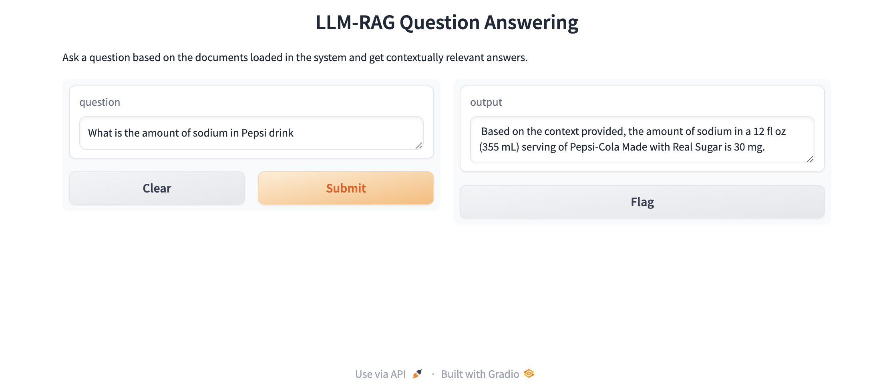

# LLM_RAG_NIM
# Overview
This Colab notebook demonstrates how to build a complex information retrieval and question-answering pipeline using LangChain and NVIDIA AI services (NVIDIA Inference Microservices). The workflow involves generating hypothetical documents, retrieving relevant documents, and providing answers to user queries based on the retrieved information.

# Installation
To get started, you need to install the required packages. Use the following commands to install them:
```
!pip install langchain_nvidia_ai_endpoints
!pip install langchain-community langchain-text-splitters faiss-cpu
!pip install PyPDF2
```

# Setup
Import Necessary Modules:
```
from langchain_nvidia_ai_endpoints import NVIDIAEmbeddings, ChatNVIDIA
from langchain_community.document_loaders import WebBaseLoader
from langchain_community.vectorstores import FAISS
from langchain_text_splitters import RecursiveCharacterTextSplitter
from langchain_core.prompts import ChatPromptTemplate
from langchain_core.output_parsers import StrOutputParser
from langchain_core.runnables import chain
from google.colab import userdata
import os
```

# Set Environment Variables
Ensure your `NVIDIA API key` is securely stored in Google Colab's user data and set as an environment variable:
```
os.environ['NVIDIA_API_KEY'] = userdata.get('NVIDIA_API_KEY')
```

# Workflow
Load Documents
Load documents from a URL using WebBaseLoader:
```
loader = WebBaseLoader("https://en.wikipedia.org/wiki/Pepsi-Cola_Made_with_Real_Sugar")
docs = loader.load()
```
For loading PDF documents, use PyPDFLoader:
```
from langchain_community.document_loaders import PyPDFLoader
pdf_file_path = "path/to/your/file.pdf"
loader = PyPDFLoader(pdf_file_path)
docs = loader.load()
```

# Generate Embeddings
Create an instance of NVIDIAEmbeddings:
```
embeddings = NVIDIAEmbeddings()
```

# Split Documents
Use `RecursiveCharacterTextSplitter` to split the documents:
```
text_splitter = RecursiveCharacterTextSplitter(chunk_size=500, chunk_overlap=50)
documents = text_splitter.split_documents(docs)
```

# Create Vector Store
Create a FAISS vector store from the documents and embeddings:
```
vector = FAISS.from_documents(documents, embeddings)
retriever = vector.as_retriever()
```

# Define Prompt Templates
Define a **HYDE** (Hypothetical Document Embeddings) template:
```
hyde_template = """Even if you do not know the full answer, generate a one-paragraph hypothetical answer to the below question:

{question}"""
hyde_prompt = ChatPromptTemplate.from_template(hyde_template)
hyde_query_transformer = hyde_prompt | model | StrOutputParser()
```

Define a template for answering questions based on provided context:
```
template = """Answer the question based only on the following context:
{context}

Question: {question}
"""
prompt = ChatPromptTemplate.from_template(template)
answer_chain = prompt | model | StrOutputParser()
```

# Create Chained Functions
Define a function to retrieve documents using HYDE:
```
@chain
def hyde_retriever(question):
    hypothetical_document = hyde_query_transformer.invoke({"question": question})
    return retriever.invoke(hypothetical_document)
```

Define the final chain function for retrieving and answering questions:
```
@chain
def final_chain(question):
    documents = hyde_retriever.invoke(question)
    for s in answer_chain.stream({"question": question, "context": documents}):
        yield s
```

# Execute the Pipeline
Run the final chain function and print the output:
```
for s in final_chain.stream("what is the value of sodium in Pepsi drink"):
    print(s, end="")
```

# Optional use gradio for a simple UI demo
Make sure you install gradio 
```
!pip install gradio
```


# Conclusion
This Colab notebook demonstrates how to build an advanced information retrieval and question-answering system using LangChain and NVIDIA NIM. The process involves generating hypothetical documents, retrieving relevant documents, and providing context-based answers, and leveraging the power of embeddings and vector search.


